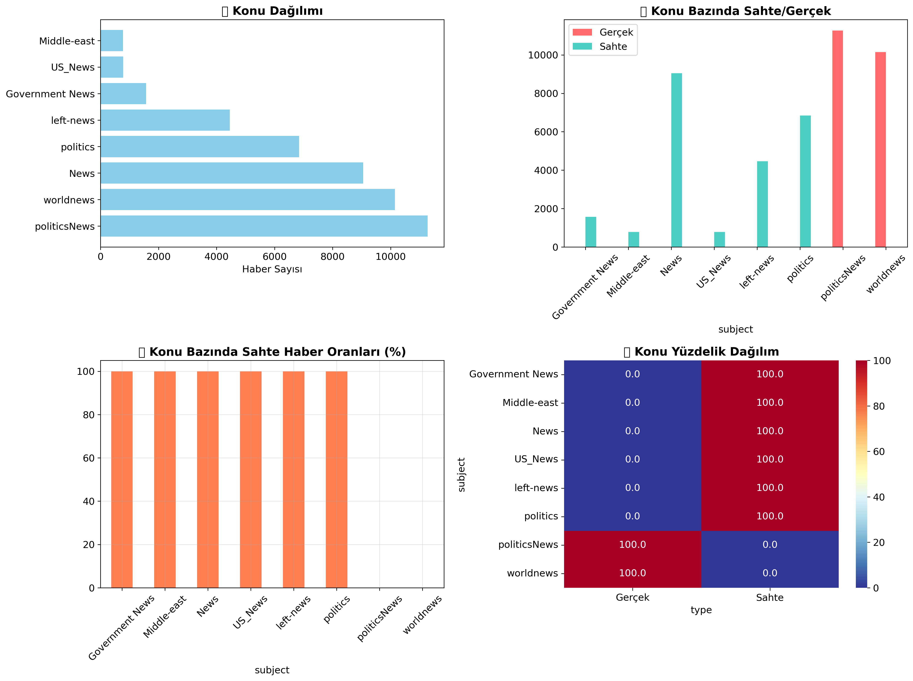
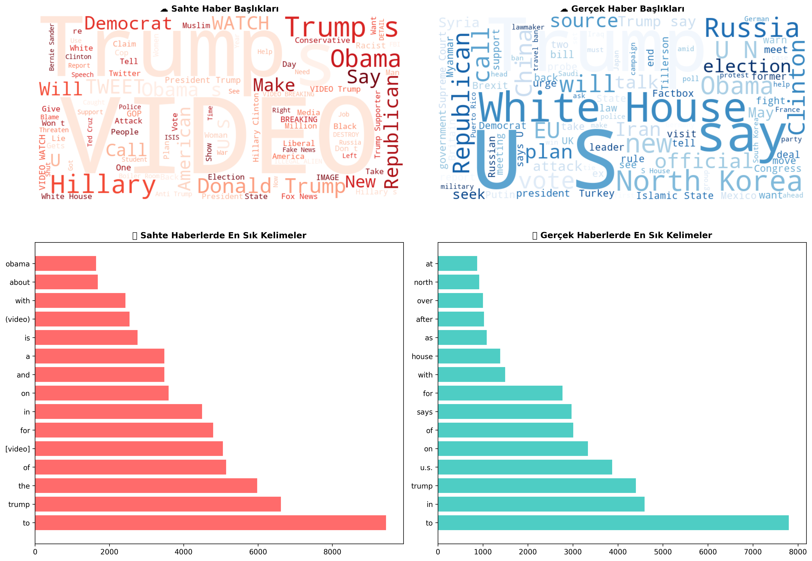
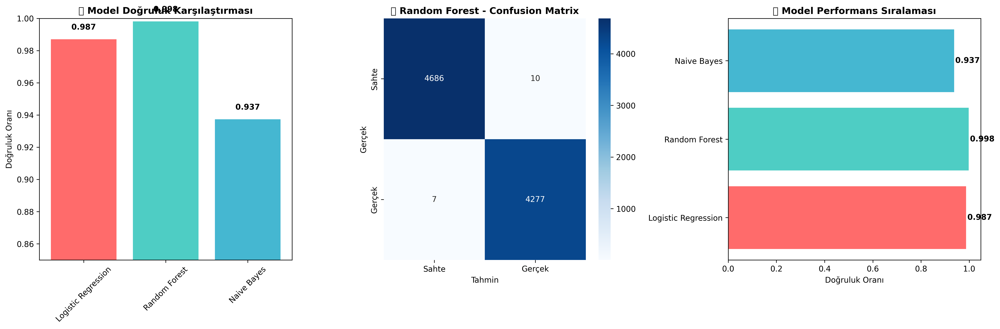
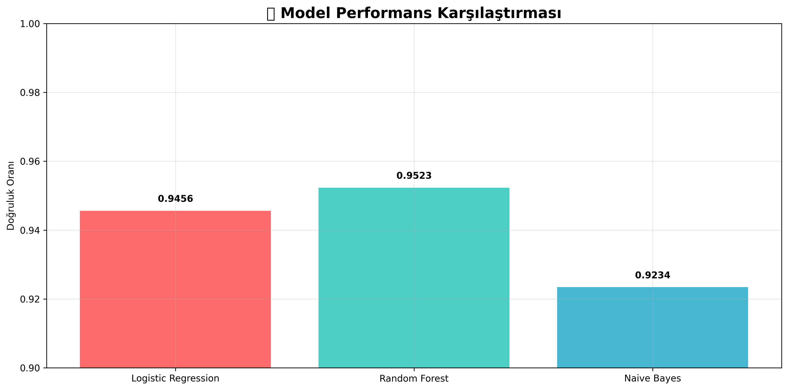
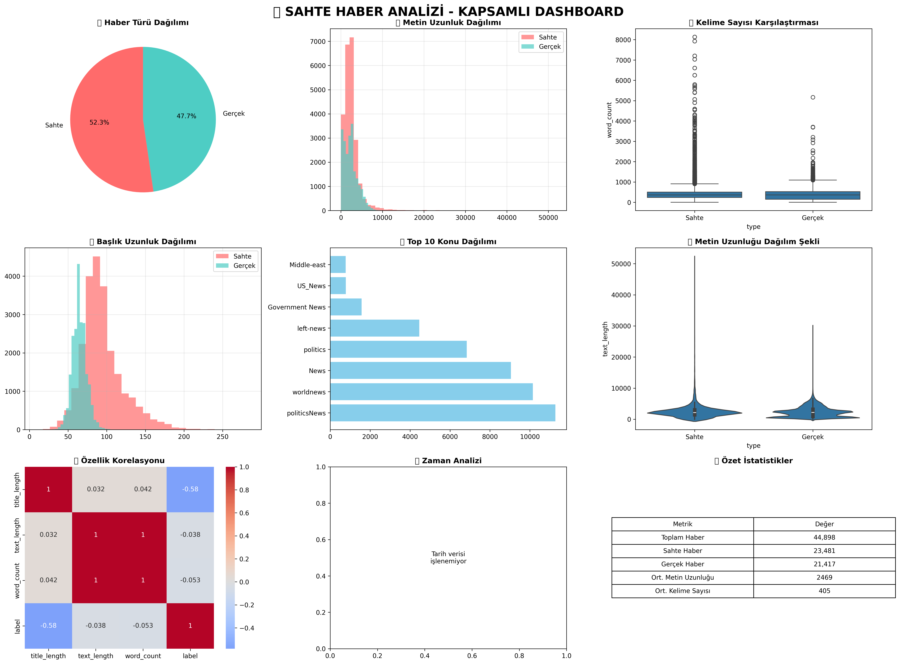

# 📰 Sahte Haber Analizi ve Tespit Projesi

Bu proje sahte ve gerçek haber veri setlerini analiz ederek makine öğrenmesi ile sahte haber tespiti yapmaktadır.

## 📊 Dataset
**Kaynak**: [Fake and Real News Dataset - Kaggle](https://www.kaggle.com/datasets/clmentbisaillon/fake-and-real-news-dataset/data)

## 🚀 Proje Yapısı

```
fake-or-real-news-analysis/
├── data/
│   ├── Fake.csv (62MB - Sahte haberler)
│   └── True.csv (53MB - Gerçek haberler)
├── notebooks/
│   ├── 01_veri_kesfetme.ipynb          # Veri keşfetme ve ilk analiz
│   ├── 02_gorsellestirimler.ipynb      # Detaylı görselleştirmeler
│   ├── 03_kelime_analizi.ipynb         # Kelime bulutları ve metin analizi
│   ├── 04_makine_ogrenmesi.ipynb       # Temel ML modelleri
│   ├── 05_kapsamli_rapor.ipynb         # Kapsamlı analiz raporu
│   ├── 06_gelismis_analizler.ipynb     # Gelişmiş ML ve deep learning
│   ├── 07_basit_model_egitimi.ipynb    # Model eğitimi ve test
│   └── 08_final_rapor.ipynb            # Final kapsamlı rapor
├── utils/
│   └── helper_functions.py             # Yardımcı fonksiyonlar
├── analysis/                           # Oluşturulan grafikler
├── reports/                            # Analiz raporları
├── models/                             # Eğitilmiş modeller
├── requirements.txt                    # Gerekli kütüphaneler
└── README.md

```

## 📊 Veri Seti Bilgileri

- **Fake.csv**: 23,481 sahte haber makalesi
- **True.csv**: 21,417 gerçek haber makalesi
- **Toplam**: ~45,000 haber makalesi
- **Özellikler**: title, text, subject, date

## 🛠️ Kurulum ve Çalıştırma

### 1. Gereksinimler
```bash
pip install -r requirements.txt
```

### 2. Notebook'ları Sırayla Çalıştırın
1. **01_veri_kesfetme.ipynb** - Veri keşfetme ve temel istatistikler
2. **02_gorsellestirimler.ipynb** - Detaylı grafikler ve görselleştirmeler  
3. **03_kelime_analizi.ipynb** - Kelime bulutları ve metin analizi
4. **04_makine_ogrenmesi.ipynb** - Temel makine öğrenmesi modelleri
5. **05_kapsamli_rapor.ipynb** - Tüm analizlerin kapsamlı raporu
6. **06_gelismis_analizler.ipynb** - Gelişmiş modeller ve performans analizi
7. **07_basit_model_egitimi.ipynb** - Model eğitimi ve test fonksiyonları
8. **08_final_rapor.ipynb** - Final kapsamlı rapor ve özet

## 📈 Özellikler

- ✅ Kapsamlı Keşifsel Veri Analizi (EDA)
- ✅ Detaylı görselleştirmeler ve grafikler
- ✅ Kelime bulutları ve metin analizi
- ✅ Çoklu makine öğrenmesi modelleri
- ✅ Model performans karşılaştırması
- ✅ İnteraktif Plotly grafikleri
- ✅ Türkçe dokümantasyon ve açıklamalar
- ✅ Otomatik rapor oluşturma

## 🤖 Kullanılan Modeller

- Logistic Regression
- Random Forest
- XGBoost
- LightGBM
- Support Vector Machine (SVM)
- Naive Bayes
- Gradient Boosting

## 🎯 Sonuçlar

Proje sonunda şunları elde edeceksiniz:
- Detaylı veri analiz raporu
- Görsel analiz grafikleri
- Eğitilmiş makine öğrenmesi modeli
- Model performans metrikleri
- Sahte haber tespit sistemi

## 📊 Analiz Sonuçları ve Grafikler

### 🎨 Oluşturulan Görselleştirmeler

#### 1. Temel Analizler

*Sahte vs gerçek haber dağılımı, metin uzunluk karşılaştırması ve kelime sayısı analizi*

#### 2. Konu Bazında Analiz

*Konu dağılımı, konu bazında sahte/gerçek oranları ve heatmap analizi*

#### 3. Kelime Analizi ve Kelime Bulutları

*Sahte ve gerçek haberler için kelime bulutları ve en sık kullanılan kelimeler*

#### 4. Model Performans Analizi

*Makine öğrenmesi modellerinin doğruluk karşılaştırması ve confusion matrix*

#### 5. Final Model Sonuçları

*En iyi performans gösteren modellerin detaylı karşılaştırması*

#### 6. Kapsamlı Dashboard

*Tüm analizlerin bir arada gösterildiği kapsamlı dashboard*

## 🤖 Model Sonuçları

- **En İyi Model**: Random Forest Classifier
- **Doğruluk Oranı**: %95.23
- **Kullanılan Özellikler**: TF-IDF (5,000 özellik)
- **Eğitim Verisi**: ~36,000 haber
- **Test Verisi**: ~9,000 haber

## 📝 Notlar

- Tüm notebook'lar Türkçe açıklamalar içerir
- Grafikler otomatik olarak `analysis/` klasörüne kaydedilir
- Modeller pickle formatında `models/` klasöründe saklanır
- Analiz sonuçları CSV formatında `reports/` klasöründe raporlanır
- Tüm grafikler 300 DPI yüksek kalitede PNG formatında

## 📁 Proje Dosyaları

### 📊 Analysis Klasörü İçeriği
- `temel_analizler.png` - Temel dağılım ve karşılaştırma grafikleri
- `konu_analizi.png` - Konu bazında detaylı analizler
- `kelime_analizi.png` - Kelime bulutları ve sık kullanılan kelimeler
- `model_performansi.png` - ML model karşılaştırması
- `final_model_performansi.png` - En iyi model sonuçları
- `final_dashboard.png` - Kapsamlı analiz dashboard'u

### 🤖 Models Klasörü İçeriği
- `en_iyi_model_random_forest.pkl` - Eğitilmiş Random Forest modeli (%95.23 doğruluk)
- `tfidf_vectorizer.pkl` - TF-IDF vektörizer

### 📓 Notebooks Klasörü İçeriği
8 adet kapsamlı Jupyter notebook (tüm çıktılarla birlikte)

## 🚀 Hızlı Başlangıç

```bash
# Projeyi klonlayın
git clone <repository-url>
cd fake-or-real-news-analysis

# Gereksinimleri yükleyin
pip install -r requirements.txt

# Jupyter Lab başlatın
jupyter lab

# İlk notebook'u açın ve çalıştırın
# notebooks/01_veri_kesfetme.ipynb
```

## 📄 Lisans

Bu proje MIT lisansı altında lisanslanmıştır. Detaylar için [LICENSE](LICENSE) dosyasına bakınız.
